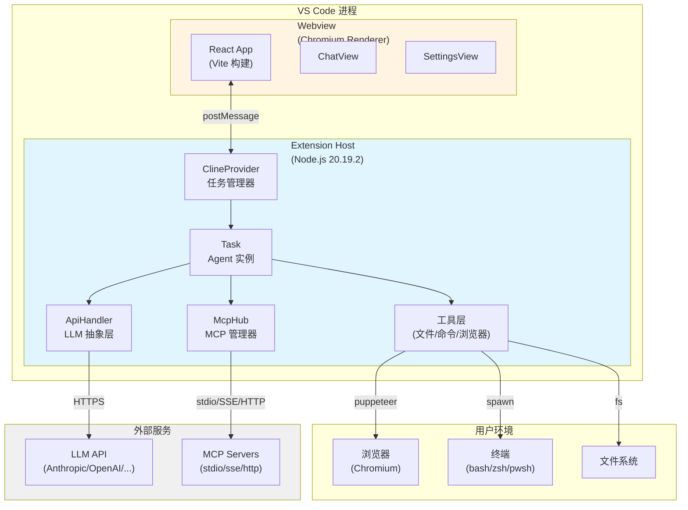

# 1. 系统容器与进程 (C4 Level 2)

> 本文档描述 Kilo Code 的进程/容器划分、职责边界和通信方式

---

## 容器视图 (VS Code Extension)



---

## 进程划分详解

### 1. Extension Host (Node.js)

**职责**:

- 任务生命周期管理
- LLM 交互与流式处理
- 工具调度与执行
- 上下文管理与压缩
- 文件系统操作
- 状态持久化

**关键模块**:

```
src/core/
├── task/Task.ts                    # Agent 核心逻辑
├── webview/ClineProvider.ts        # Provider 管理器
├── tools/                          # 工具实现
├── context-management/             # 上下文管理
└── prompts/                        # 系统提示构建

src/api/
├── index.ts                        # LLM 抽象层入口
└── providers/                      # 50+ Provider 实现

src/services/
├── browser/BrowserSession.ts       # 浏览器自动化
├── mcp/McpHub.ts                   # MCP 集成
└── checkpoints/                    # Checkpoint 系统
```

**资源限制**:

- 内存: 200-500 MB
- CPU: 单线程 (Node.js 主线程)
- 网络: 无限制

**依据**: `src/extension.ts:45` - Extension 入口点

---

### 2. Webview (Chromium Renderer)

**职责**:

- UI 渲染与交互
- 用户输入处理
- 实时消息展示
- 配置管理界面
- 任务历史浏览

**关键模块**:

```
webview-ui/src/
├── App.tsx                         # 应用入口
├── components/
│   ├── chat/ChatView.tsx          # 聊天界面
│   ├── settings/SettingsView.tsx  # 设置界面
│   └── history/HistoryView.tsx    # 历史界面
└── utils/
    └── vscode.ts                   # VS Code API 封装
```

**状态管理**: Jotai (原子化状态)

```typescript
// webview-ui/src/context/ExtensionStateContext.tsx
const [state, setState] = useAtom(extensionStateAtom)
```

**资源限制**:

- 内存: 100-200 MB
- CPU: 主线程 + Web Workers (如果使用)
- 网络: 仅通过 postMessage 与 Extension Host 通信

**依据**: `webview-ui/src/index.tsx:8` - Webview 入口点

---

### 3. Chromium Browser (Puppeteer)

**职责**:

- 网页渲染与交互
- JavaScript 执行
- 截图生成
- Console 日志捕获

**启动方式**:

```typescript
// src/services/browser/BrowserSession.ts:72-82
const stats = await this.ensureChromiumExists()
this.browser = await stats.puppeteer.launch({
	args: [
		"--user-agent=Mozilla/5.0 ...",
		"--disable-dev-shm-usage",
		"--no-sandbox", // Linux only
	],
	executablePath: stats.executablePath,
	defaultViewport: { width: 900, height: 600 },
})
```

**生命周期**:

- 按需启动 (首次 `browser_action` 或 `@url` 提及)
- 跨多轮对话保持
- 用户关闭或任务结束时销毁

**资源限制**:

- 内存: 200-400 MB
- CPU: 多进程 (Chromium 架构)
- 磁盘: ~500 MB (Chromium 缓存)

**依据**: `src/services/browser/BrowserSession.ts:39-58`

---

### 4. Terminal Process (子进程)

**职责**:

- 执行 shell 命令
- 捕获 stdout/stderr
- 支持交互式输入

**启动方式**:

```typescript
// src/integrations/terminal/Terminal.ts
const process = spawn(shell, args, {
	cwd: this.cwd,
	env: { ...process.env, ...customEnv },
	shell: true,
})
```

**生命周期**:

- 每个 `execute_command` 创建新进程
- 命令执行完成后自动销毁
- 支持 Ctrl+C 中止

**资源限制**:

- 内存: 取决于命令
- CPU: 取决于命令
- 网络: 取决于命令

**依据**: `src/integrations/terminal/Terminal.ts:100+`

---

### 5. MCP Servers (外部进程)

**职责**:

- 提供外部工具能力
- 暴露资源 (文件、数据库等)
- 执行特定领域任务

**通信方式**:

```typescript
// src/services/mcp/McpHub.ts:200+
switch (config.transport) {
	case "stdio":
		// 通过 stdin/stdout 通信
		const process = spawn(config.command, config.args)
		break
	case "sse":
		// 通过 Server-Sent Events 通信
		const eventSource = new EventSource(config.url)
		break
	case "streamable-http":
		// 通过 HTTP 流式通信
		const response = await fetch(config.url)
		break
}
```

**生命周期**:

- Extension 启动时自动连接
- 保持长连接
- Extension 关闭时断开

**资源限制**:

- 取决于具体 MCP Server 实现

**依据**: `src/services/mcp/McpHub.ts:200-300`

---

## 进程间通信 (IPC)

### 1. Extension Host ↔ Webview

**协议**: `vscode.postMessage` (VS Code 提供的安全通道)

**消息流向**:

```typescript
// Extension Host → Webview
// src/core/webview/ClineProvider.ts:1960
async postStateToWebview() {
  this.view?.webview.postMessage({
    type: "state",
    state: await this.getState()
  })
}

// Webview → Extension Host
// webview-ui/src/utils/vscode.ts:10
vscode.postMessage({
  type: "newTask",
  text: userInput,
  images: selectedImages
})
```

**消息类型**:

```typescript
// src/shared/ExtensionMessage.ts
export type ExtensionMessage =
	| { type: "state"; state: ExtensionState }
	| { type: "partialMessage"; partialMessage: ClineMessage }
	| { type: "taskMetadataSaved"; payload: [string, string] }
// ... 50+ 消息类型

// src/shared/WebviewMessage.ts
export type WebviewMessage =
	| { type: "newTask"; text?: string; images?: string[] }
	| { type: "apiConfiguration"; apiConfiguration: ProviderSettings }
	| { type: "askResponse"; askResponse: ClineAskResponse; text?: string }
// ... 30+ 消息类型
```

**依据**: `src/core/webview/webviewMessageHandler.ts:20` - 消息路由器

---

### 2. Extension Host → LLM API

**协议**: HTTPS (REST API + Server-Sent Events)

**请求格式**:

```typescript
// Anthropic
const response = await this.client.messages.create({
	model: "claude-3-5-sonnet-20241022",
	max_tokens: 8192,
	system: systemPrompt,
	messages: conversationHistory,
	tools: toolDefinitions,
	stream: true,
})

// OpenAI
const response = await this.client.chat.completions.create({
	model: "gpt-4-turbo",
	max_tokens: 4096,
	messages: conversationHistory,
	tools: toolDefinitions,
	stream: true,
})
```

**流式处理**:

```typescript
// src/api/providers/anthropic.ts:100+
for await (const chunk of stream) {
  switch (chunk.type) {
    case "content_block_delta":
      yield { type: "text", text: chunk.delta.text }
      break
    case "message_delta":
      yield { type: "usage", inputTokens: chunk.usage.input_tokens, ... }
      break
  }
}
```

**依据**: `src/api/providers/anthropic.ts:80-200`

---

### 3. Extension Host → MCP Servers

**协议**: stdio / SSE / HTTP (取决于 MCP Server 配置)

**stdio 示例**:

```typescript
// src/services/mcp/McpHub.ts:250+
const process = spawn(config.command, config.args, {
	stdio: ["pipe", "pipe", "pipe"],
})

// 发送请求
process.stdin.write(
	JSON.stringify({
		jsonrpc: "2.0",
		method: "tools/call",
		params: { name: "search", arguments: { query: "..." } },
	}),
)

// 接收响应
process.stdout.on("data", (data) => {
	const response = JSON.parse(data.toString())
	// 处理响应
})
```

**依据**: `src/services/mcp/McpHub.ts:200-400`

---

### 4. Extension Host → File System

**协议**: Node.js `fs` 模块 (系统调用)

**操作示例**:

```typescript
// 读取文件
const content = await fs.readFile(absolutePath, "utf-8")

// 写入文件
await fs.writeFile(absolutePath, newContent)

// 监听文件变化
const watcher = vscode.workspace.createFileSystemWatcher(pattern)
watcher.onDidChange(() => {
	/* ... */
})
```

**依据**: `src/core/tools/ReadFileTool.ts:340`

---

### 5. Extension Host → Terminal

**协议**: Node.js `child_process.spawn` (进程管道)

**通信示例**:

```typescript
// src/integrations/terminal/Terminal.ts:100+
const process = spawn(shell, args, {
	cwd: this.cwd,
	env: process.env,
})

// 发送输入
process.stdin.write(input + "\n")

// 接收输出
process.stdout.on("data", (data) => {
	this.output += data.toString()
})

// 接收错误
process.stderr.on("data", (data) => {
	this.output += data.toString()
})
```

**依据**: `src/integrations/terminal/Terminal.ts:100-200`

---

## 多平台适配

### CLI 模式

**进程结构**:

```
┌─────────────────────────────────┐
│ CLI Process (Node.js)           │
│  ├─> ExtensionService (复用)    │
│  ├─> Ink TUI (React)            │
│  └─> SessionManager             │
└─────────────────────────────────┘
```

**关键差异**:

- 无 VS Code API，使用 polyfill
- Ink 替代 Webview 渲染 UI
- 直接文件系统访问

**依据**: `cli/src/index.ts:20` - CLI 入口

---

### JetBrains Plugin

**进程结构**:

```
┌─────────────────────────────────┐
│ JetBrains IDE (JVM)             │
│  └─> Kotlin Plugin              │
│       └─> Socket Client         │
└──────────────┬──────────────────┘
               │ TCP Socket
               ▼
┌─────────────────────────────────┐
│ Extension Host (Node.js)        │
│  └─> Socket Server (net)        │
│       └─> ExtensionService      │
└─────────────────────────────────┘
```

**通信协议**: Socket RPC (自定义协议)

**依据**: `jetbrains/host/src/main.ts:30` - Socket Server

---

## 容器生命周期

### Extension Host

**启动**:

```typescript
// src/extension.ts:45
export async function activate(context: vscode.ExtensionContext) {
	// 1. 初始化全局服务
	CloudService.initialize(context)
	TelemetryService.initialize(context)

	// 2. 创建 Provider
	const sidebarProvider = new ClineProvider(context, outputChannel)

	// 3. 注册 Webview
	context.subscriptions.push(vscode.window.registerWebviewViewProvider(ClineProvider.sideBarId, sidebarProvider))
}
```

**关闭**:

```typescript
// src/extension.ts:200
export async function deactivate() {
	// 清理资源
	await CloudService.dispose()
	await TelemetryService.dispose()
}
```

**依据**: `src/extension.ts:45-200`

---

### Webview

**创建**:

```typescript
// src/core/webview/ClineProvider.ts:300+
public resolveWebviewView(webviewView: vscode.WebviewView) {
  this.view = webviewView

  webviewView.webview.options = {
    enableScripts: true,
    localResourceRoots: [this.context.extensionUri]
  }

  webviewView.webview.html = this.getHtmlContent(webviewView.webview)

  // 监听消息
  webviewView.webview.onDidReceiveMessage(async (message) => {
    await webviewMessageHandler(this, message)
  })
}
```

**销毁**:

- VS Code 自动管理 Webview 生命周期
- 用户关闭侧边栏时销毁
- 重新打开时重建

**依据**: `src/core/webview/ClineProvider.ts:300-400`

---

## 资源管理

### 内存管理

**Extension Host**:

- 任务历史限制: 最多保留 100 个任务
- 上下文截断: 超过阈值自动压缩/截断
- 图像压缩: 自动调整大小和质量

**Webview**:

- 虚拟滚动: 仅渲染可见消息
- 图像懒加载: 按需加载图像
- 状态原子化: Jotai 细粒度更新

**依据**: `src/core/context-management/index.ts:66`

---

### 磁盘管理

**任务持久化**:

```
~/.kilocode/tasks/{taskId}/
├── api_conversation_history.json  # API 消息历史
├── cline_messages.json             # UI 消息历史
├── task_metadata.json              # 任务元数据
└── checkpoints/                    # Git checkpoints
```

**清理策略**:

- 手动删除任务
- 无自动清理 (用户控制)

**依据**: `src/core/task-persistence/`

---

## 故障隔离

### 1. Webview 崩溃

**影响**: UI 不可用，但 Extension Host 继续运行

**恢复**: VS Code 自动重启 Webview

---

### 2. Extension Host 崩溃

**影响**: 整个扩展不可用

**恢复**: VS Code 自动重启 Extension Host，任务状态从磁盘恢复

---

### 3. Browser 崩溃

**影响**: 浏览器操作失败

**恢复**: 下次 `browser_action` 自动重启浏览器

**依据**: `src/services/browser/BrowserSession.ts:171`

---

### 4. MCP Server 崩溃

**影响**: 该 MCP Server 的工具不可用

**恢复**: 自动重连 (最多 3 次)

**依据**: `src/services/mcp/McpHub.ts:400+`

---

## 下一步

继续阅读 **[2. 模块分层架构](./2.Module-Layers.md)** 了解代码组织结构。
