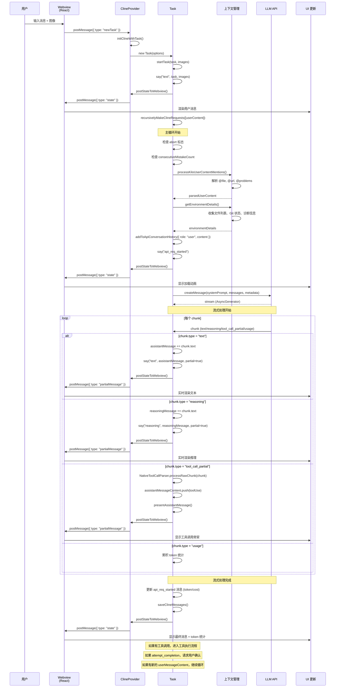
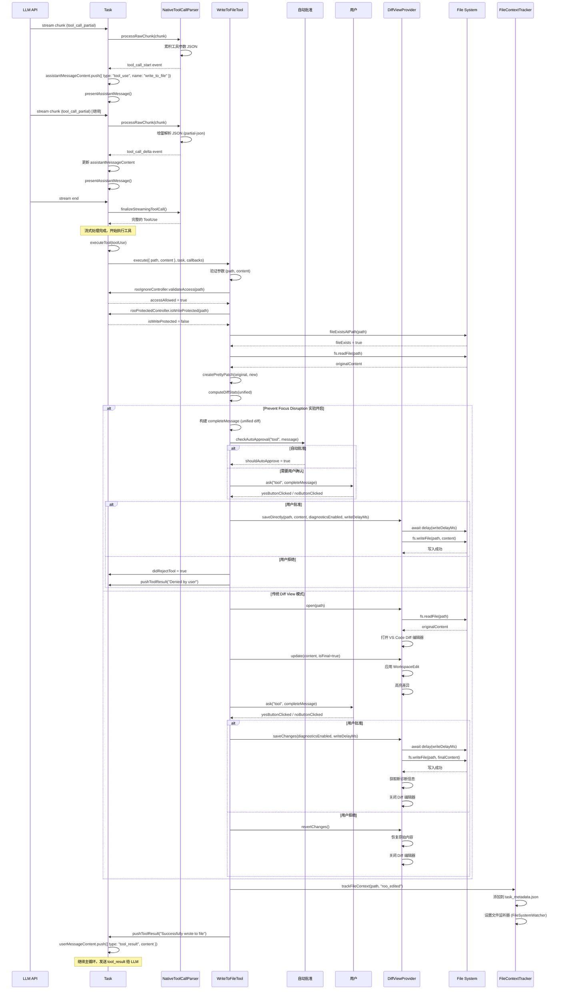
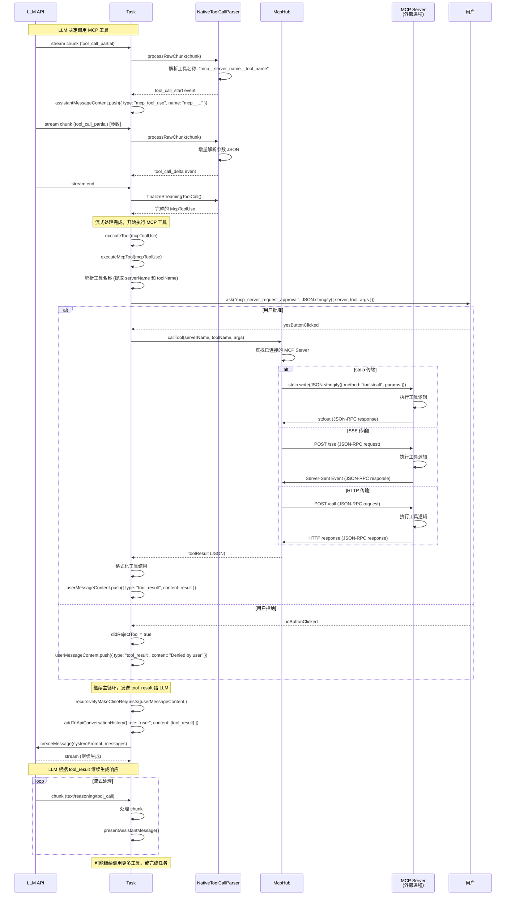
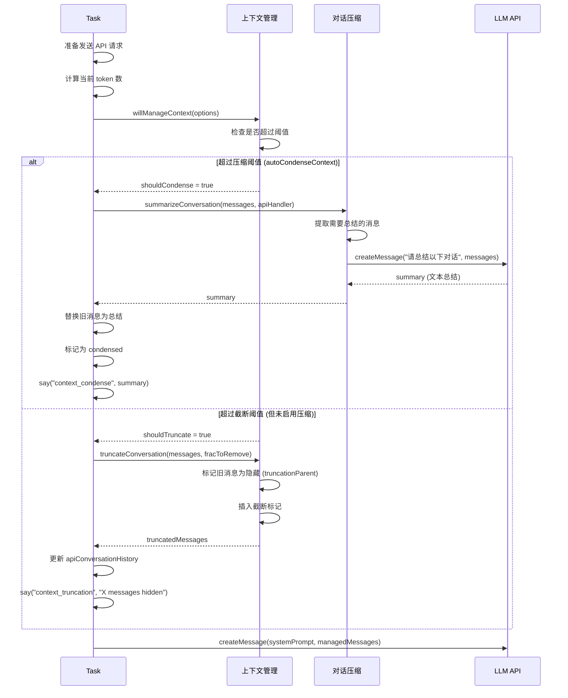
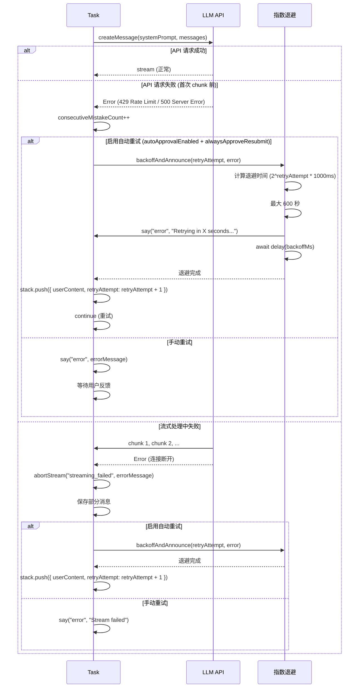

# 3. 核心流程时序

> 本文档描述三条关键时序图：用户聊天、编辑应用、MCP 工具调用

---

## 时序图 A: 用户聊天（流式）从触发到渲染

**关键文件依据**:

- 用户输入: `webview-ui/src/components/chat/ChatView.tsx:200`
- 消息路由: `src/core/webview/webviewMessageHandler.ts:50`
- 主循环: `src/core/task/Task.ts:2378`
- 流式处理: `src/core/task/Task.ts:2700-3200`
- UI 更新: `src/core/webview/ClineProvider.ts:1960`

---

## 时序图 B: LLM 输出编辑建议 → apply edits → 写回文件

**关键文件依据**:

- 工具解析: `src/core/assistant-message/NativeToolCallParser.ts:50-200`
- 工具执行: `src/core/task/Task.ts:1737`
- 写入工具: `src/core/tools/WriteToFileTool.ts:37-232`
- Diff View: `src/integrations/editor/DiffViewProvider.ts:49-222`
- 文件追踪: `src/core/context-tracking/FileContextTracker.ts:81-95`

---

## 时序图 C: LLM 触发 tool call → MCP → result → 继续生成

**关键文件依据**:

- MCP 工具执行: `src/core/task/Task.ts:4400-4500`
- MCP Hub: `src/services/mcp/McpHub.ts:400-600`
- MCP 连接: `src/services/mcp/McpHub.ts:200-300`
- 工具调用: `src/services/mcp/McpHub.ts:500-700`

---

## 补充时序：上下文管理触发

**关键文件依据**:

- 上下文管理: `src/core/context-management/index.ts:150-300`
- 对话压缩: `src/core/condense/index.ts:100-250`
- 截断逻辑: `src/core/context-management/index.ts:66-134`

---

## 补充时序：错误处理与重试

**关键文件依据**:

- 错误处理: `src/core/task/Task.ts:3221-3278`
- 指数退避: `src/core/task/Task.ts:3500-3600`
- 重试逻辑: `src/core/task/Task.ts:3268-3276`

---

## 性能关键点

### 1. 流式渲染优化

- **虚拟滚动**: 仅渲染可见消息 (Webview)
- **增量更新**: 使用 `partial=true` 标记增量消息
- **防抖**: UI 更新防抖 100ms

**依据**: `webview-ui/src/components/chat/ChatView.tsx:100`

---

### 2. 上下文管理优化

- **延迟压缩**: 仅在接近阈值时触发
- **非破坏性截断**: 标记隐藏而非删除
- **Token 预算**: 文件读取前检查 token 预算

**依据**: `src/core/context-management/index.ts:150`

---

### 3. 并发控制

- **单例任务**: 同一时间只有一个活跃 Task
- **串行工具执行**: 工具按顺序执行
- **流式锁**: `isStreaming` 标志防止并发流

**依据**: `src/core/task/Task.ts:2613`

---

## 下一步

继续阅读 **[4. 关键接口规范](./4.Key-Interfaces.md)** 了解接口定义与契约。
